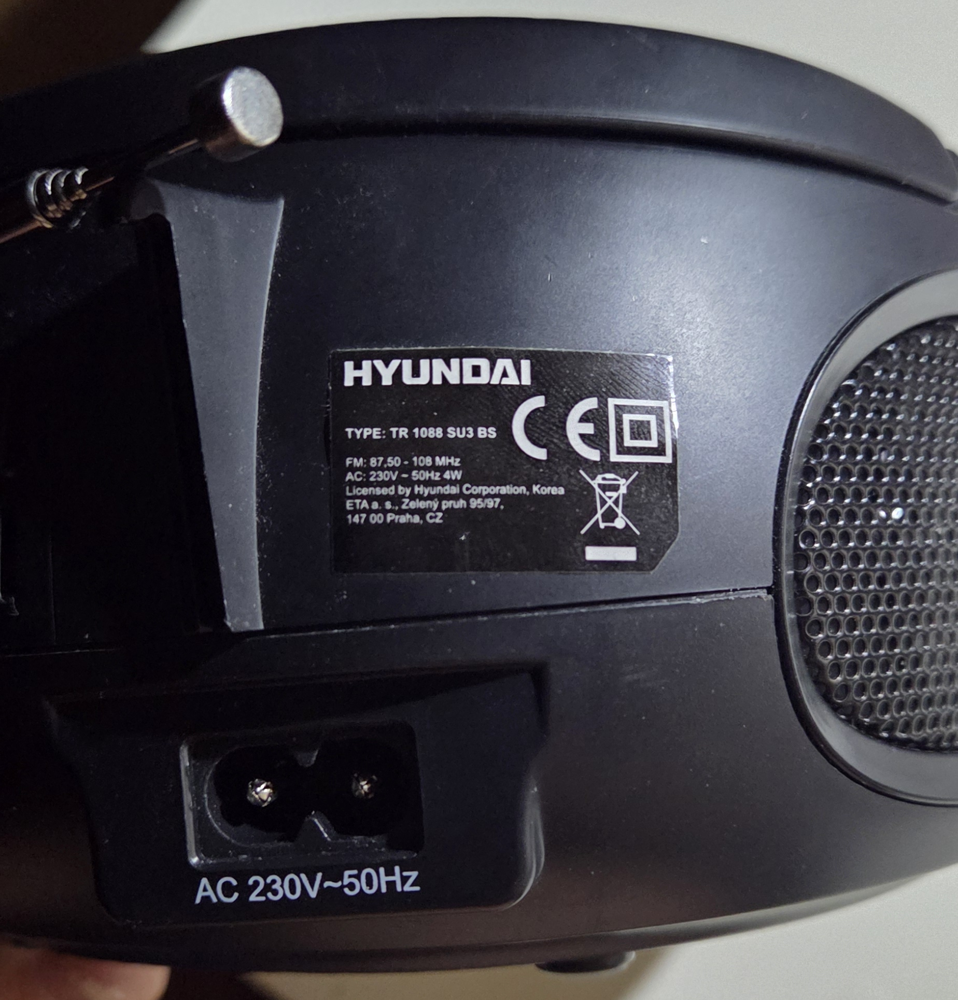
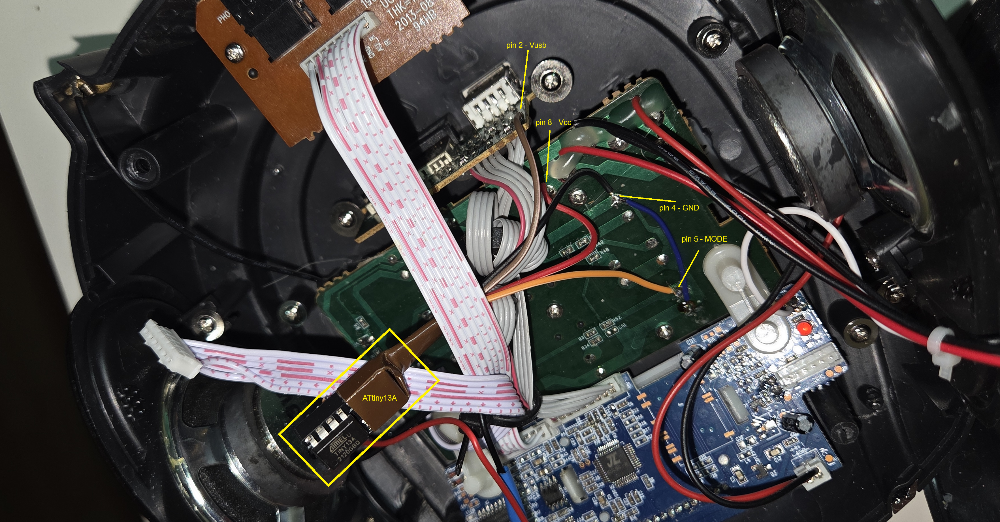
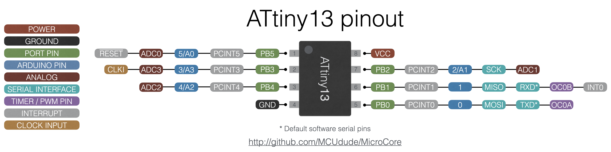
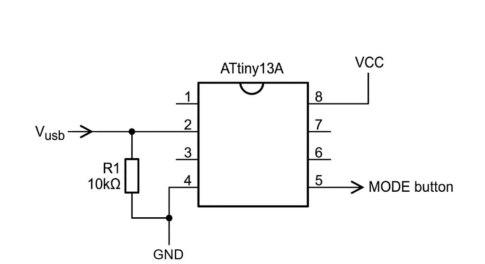

# PROBLEM DESCRIPTION
Grandma has a radio, type is HYUNDAI TR 1088 SU3 BS (manufactured by ETA under license).
The default mode after first power-on is "USB mode". MODE button must be pressed to switch to "FM mode".
This mod uses AVR (ATtiny13A) to switch the radio to "FM mode" automatically.
After first action the AVR goes to sleep mode indefinitely.

## Arduino Nano as ISP programmer
- open Arduino IDE
- File -> Examples -> 11.ArduinoISP -> ArduinoISP
- flash to Arduino Nano
- if using USB2Serial chip onboard the Nano (CH340/FT232), connect after programming either (not both):
    - pull-up resistor (110R to 120R) between RST and 5V.
    - capacitor 10uF or larger between RST(+) and GND(-).

## ATtiny13 programming (more on https://github.com/MCUdude/MicroCore)
- open Asruino IDE
- File ->Preferences -> Additional boards manager URLs -> https://mcudude.github.io/MicroCore/package_MCUDude_MicroCore_index.json
- Tools -> Board -> Board manager / find and install MicroCore
- Open sketch
- Tools -> Board: switch board to ATtiny13
- Tools -> Port: COM3
- Tools -> BOD: 4.7V
- Tools -> Bootloader: No bootloader
- Tools -> Clock: 1.2MHz internal osc.
- Tools -> EEPROM: not retained
- Tools -> Programmer: Arduino as ISP
- Tools -> Burn Bootloader
- Sketch -> Compile & Upload

## Assembly
See images for inspiration. Use your skills to hack this together.

